# Implementation Plan: Client polish: visuals, controls and missing gameplay

**Branch**: `002-client-polish` | **Date**: 2026-11-09 | **Spec**: [spec.md](spec.md)

**Input**: Feature specification from `specs/002-client-polish/spec.md` (Spile ticket CC-0001 as a whole);
constitution `.specify/memory/constitution.md` (project Principles I and II with SDD amendment v6.3.0); personas
`.specify/memory/personas.md`. Behaviour values come from `docs/protocol/` and `docs/design/` only (Principle II);
this plan decides packages, modules, data flow, tooling, tests and gates, not game values.

**Companion artifacts**: [research.md](research.md) (decisions R1 to R16, spike evidence, handoff verification),
[data-model.md](data-model.md), [contracts/](contracts/), [quickstart.md](quickstart.md), [spikes/](spikes/).

## Operator decisions (recorded) and open markers

Recorded from the spec's Clarifications session 2026-11-09 and inherited by this plan: (1) the standard world
choice stays selectable while the packs are invalid and Create is refused with the explanation (FR-003); (2) one
`cobolcraft:crafting_bench` block and item are added to the cobolcraft type, and other content needed to make that
type work under the shared rules may be added once recorded in the design documents first (FR-027); (3) invented
content stays in `cobolcraft:`, the standard world uses only `minecraft:`, the two types share no content (FR-005).
The adopted defaults of `docs/design/README.md` Part 7 stand (spec Assumptions). Constitution Development Workflow
settles the two process questions: workspace bootstrap is `make bootstrap`, deferred work is Spile tickets
(`tickets/`, prefix `CC`).

Two decisions the plan phase has no authority to make remain open. The tasks phase MUST NOT start until both are
recorded (constitution 1.3).

- Q-1 (operator accepted the manual run, 2026-11-09) Vanilla-client verification (spec US21, FR-039, SC-013). The plan sets the scope as
  (a) automated byte-level conformance tests of the standard server's configuration phase, Login and chunk data
  against the documents (`contract_vanilla_*`), plus (b) a manual run of a real vanilla 26.3 client through
  configuration into play, recorded once at the terminal phase (quickstart §9). No automated launch of a vanilla
  client can exist: the jar is not runnable without the launcher's libraries and nothing under `~/.minecraft`
  is present (research probe table). Does the operator accept the manual run as the verification of SC-013, or
  require an automated harness (which needs the operator to supply and pin a launcher environment)? Decision:
  accept manual.
- Q-2 (operator sanctioned the test double, 2026-11-09) Open Pack Folder test (spec US4, FR-008, SC-010). The button starts the system
  opener on a folder. A test that runs the real `/usr/bin/open` opens a real Finder window on every gate run. A
  sanctioned double is the alternative: the client state names the opener program, production sets
  `/usr/bin/open`, and tests set a harmless real executable (`/usr/bin/true`) while a second test proves the
  production string and the missing-opener path through the shim contract test. Real-config debt of that double:
  none (`/usr/bin/open` exists on every macOS and the spike `command -v open` confirmed it), and the aggregated
  run-level signal is one line from the client test run naming the opener substituted. Does the operator sanction
  this double, or require the real opener in the test? Decision: sanction.

## Summary

Add to the finished 001 game: a COBOL extraction tool and loaders for the user's own vanilla jar (US1); two world
types over one set of shared rules (US2); user resource packs including Faithful 32x with a seamless, animated,
pack-resolution atlas (US3 to US5); deliberate-looking HUD and screens (US6); the missing controls and screens:
creative-only flight, break overlay, inventory and bench crafting with the recipe book, options, pack folder
button, F3, F5, off-hand swap, held hand (US4, US7 to US10, US16 to US20); and the standard world: terrain, caves,
ores, features, structures, the Nether, the End, redstone, block entities, commands, tools, mobs (US11 to US15),
with a path to validate the ids, registries and chunk encodings against a vanilla client (US21).

Technical approach (research R1 to R16). Three new COBOL packages: `formats` (the JSON, ZIP, PNG, regex readers
the client owns today, moved, plus CRC-32, SHA-256 and strict JSON), `content` (registry model, the registries
generated from documents 24, 25 and 46 by a drift-gated generator, the data pack loaders, the two content sets),
and `extract` (the tool of document 22). `core` and `client` re-base on `content`: 16-bit block states, 24-section
chunks, three dimensions, the shared rule engines written once and fed by either content set. `shim` gains only
glue that COBOL cannot express cleanly: IEEE-double arithmetic by reference (a measured 100 times speed-up that
makes bit-exact terrain affordable), texture mip levels and sub-updates, a depth clear and a path opener. Missing
values are resolved by clean-room documentation rounds before the slice that needs them, never guessed (FR-042).

## Technical Context

**Language/Version**: GnuCOBOL 3.2.0 (free format, `-std=default`, `-debug`; release builds `-O2`) for all game
logic; C11 (Apple clang) for the shim; GLSL 450 to SPIR-V; Python 3 (stdlib only) for the table generator, test
and build tooling.

**Primary Dependencies**: as 001 (GLFW 3.5.1, Vulkan loader 1.4 with MoltenVK, glslang, zlib, OpenSSL 3), plus:
OpenSSL `EVP_sha256` called directly from COBOL (spike `spike_jar_digest`), libm `fma`/`strtod` behind
`cc_f64_*` glue (spike `spike_f64`). No new library.

**Storage**: files: world folders (NBT and Anvil, `WorldType`/`Seed`/`ContentJar` added), the generated directory
(`<game dir>/generated`), `options.txt`, the pack cache, the user's `resourcepacks/`.

**Testing**: as 001 (`acc_`, `contract_`, `test_` programs, `tools/runtests.py`, gcov to 100 %, `cobc -Wall
-Werror` lint), with the additions of `contracts/test-harness-delta.md`: real-jar tests fail loudly when
`tmp/minecraft-26.3-client.jar` is absent; no skips.

**Target Platform**: macOS, Apple silicon, only (001 FR-011).

**Project Type**: two desktop programs and one command-line tool sharing libraries; monorepo packages built and
tested independently.

**Performance Goals**: none are specified (spec, constitution 2.7). Measured limits the design must respect are
Risks R-P and R-M, not goals.

**Constraints**: COBOL for logic; C only as logic-free glue (Principle I); work from the documents only
(Principle II, FR-042); offline identity; single-threaded programs (001 R6); no sounds, lighting visuals, sky, fog
or clouds (FR-043).

**Scale/Scope**: 21 user stories; about 1,200 blocks, 30,000 block states, 1,500 items; documents 10 to 47 (the
largest family, 24 to 25, is 1.9 MB of tables); every standard command, tool and mob.

## Constitution Check

*GATE: evaluated before Phase 0 and re-evaluated after Phase 1.*

| Principle | Status | Evidence |
|---|---|---|
| I. COBOL-first, thin C glue | Pass | All logic (extraction, loaders, registries, engines, UI) is COBOL. The only new glue (`contracts/shim-delta.md`) is ABI and platform adaptation: by-reference double arithmetic (COBOL cannot receive a C double return: spike `spike_fma_calls` returned 0), Vulkan mip/sub-update/depth-clear, a process spawn. OpenSSL digests, `CBL_*` file and directory routines are called directly (spike `spike_jar_digest`). The table generator and drift gate are build tooling (any language). |
| II. Spec is the source of truth | Pass | Every behaviour value is read from a named document; open questions that bear on slices are closed by clean-room rounds in Foundational ("Docs-first obligations"); a gap found later stops its slice and goes back to a round. The registry tables are generated from the documents, not retyped. |
| 1.1 Artifact completeness | Pass | This plan plus companions carry every decision. |
| 1.3 Clarification markers / tasks gate | Open (2) | Q-1 and Q-2 above; tasks generation is blocked until recorded. |
| 1.4 Deferred work | Pass | Spile tickets; CC-0003, CC-0005, CC-0006 incorporated, CC-0002 and CC-0004 stay recorded (research R15); nothing new is deferred. |
| 2.5 Dependency-aware sequencing | Pass | Lane phases follow the spec's story order US1 to US21; cross-lane edges are listed ("Lane notes"). |
| 2.6 Handoff consumed | Pass | research "Handoff verification record". |
| 3.1 External dependencies probed | Pass with two risks | GnuCOBOL file routines, OpenSSL, Vulkan limits, the user's jar and pack, compile and arithmetic speed, `open`: probed (`spikes/`). A real vanilla client and a real Finder cannot be probed: Q-1, Q-2. |
| 3.2 Gap analysis | Pass | "Empirical gap analysis" below. |
| 3.3 Package boundaries and contracts | Pass | "Package boundary declaration" and eight contracts in `contracts/`, materialized in Foundational before any consumer task. |
| 3.4 Test infrastructure | Pass (gaps planned) | "Infrastructure setup": the new packages' Makefiles, the generator drift gate, the real-input convention are Setup and Foundational tasks. CI does not exist (001). |
| 3.5 Sequence diagrams | Pass | One per story below. |
| 3.6 Execution mode | Pass | Package-parallel; `make bootstrap` is defined in the constitution. |
| 3.8 Debt survey | Pass | "Technical debt survey" below. |
| 4.1 Test-first, ladder, BDD, contract tests, doubles | Pass, one double pending | "Test strategy". The only double proposed is Q-2; none else. |
| 4.2 Coverage | Pass | gcov 100 % of every COBOL and C production source; excluded: generated copybooks `content/copy/gen/` (data, produced by `tools/gen`), tests, `tools/`. |
| 4.3 E2E | Pass | Inventory empty, none proposed ("E2E inventory"). |
| 5.6 Error handling | Pass | Only defined outcomes are handled: the CCX codes of 22 §7.4, the packs status words, pack errors (08), the WT-23 foreign-key case, options defaults; everything else stays fatal under `-debug`. |

Post-design re-check (after Phase 1 artifacts): unchanged. The design adds no behaviour without an acceptance
criterion: every contract row traces to a spec story or FR (contract tables cite them), the chunk-generation
queue (R12) and table generator are mechanisms, and the legacy `options.dat` reader (R8) is covered by
an acceptance scenario of US16 (a Player's enabled packs survive the upgrade; recorded here because the spec is
silent on migration: see "Spec observations" 7).

## Project Structure

### Documentation (this feature)

```text
specs/002-client-polish/
├── spec.md
├── plan.md                 # this file
├── research.md             # Phase 0
├── data-model.md           # Phase 1
├── quickstart.md           # Phase 1
├── contracts/              # formats-api, content-api, extract-cli, shim-delta, core-host-delta,
│                           #   wire-delta, client-surface-delta, test-harness-delta
├── spikes/                 # spike_* probes and *.out.txt evidence
├── checklists/requirements.md
└── tasks.md                # Phase 2 (/speckit-tasks), blocked by Q-1 and Q-2
```

### Source code (repository root; new or changed packages marked)

```text
Makefile                    # PKGS gains formats content extract; gate-tables; DEPS_/TARGETS_ per package
contract/                   # frozen shared surface (Foundational only; lanes read, never write)
├── include/ccshim.h        # + cc_f64_*, cc_vk_texture_ex, cc_vk_texture_update, cc_vk_clear_depth, cc_open_path
├── copy/                   # CCSHIM.cpy (+keys), COREAPI.cpy (+settings), PROTO.cpy (+composites), new CONTENT.cpy,
│                           #   FORMATS.cpy, CELLS.cpy (one cell/chunk layout replacing core CHUNKMEM.cpy + client CLCELLS.cpy)
└── fixtures/               # wire/*.hex (+), formats/, content/, extract/, client/ (small hand-made trees)
shim/                       # + cc_f64.c, cc_open.c; cc_vk.c extended (mips, sub-update, depth clear)
formats/   (NEW)            # json (moved), json-strict, zip (moved, extended), crc32, sha256, png (moved), regex (moved), files
content/   (NEW)            # copy/gen/*.cpy (generated), src/: packs-check, content-open, registry, tags, blocks, items,
│                           #   entities, loaders, client-registry, builtin layer (cobolcraft core)
extract/   (NEW)            # src/: main (one CALL of EX-MAIN), args, jar, check, plan, walk, manifest, verify → build/bin/cobolcraft-extract
proto/                      # + item stack with components, chunk palettes for 24 sections, command nodes full, recipe/menu/entity packets
core/                       # re-based on content; src split by concern (see debt survey); new engines per slice table
server/                     # + config keys world-type, generated-dir; console texts of 22 §9.2
client/                     # json/zip/png/regex moved out; atlas, packs, screens, controls, options, hand, camera, entity models
tools/
├── gen/gen_tables.py       # (NEW) documents 24/25/46 → content/copy/gen/*.cpy; --check is the drift gate
├── runtests.py coverage.py lint.py bootstrap.sh package.mk       # PACKAGES/DEPENDENCIES extended
└── tests/                  # acc_f2us*: generator and gate behaviour
tests/convergence/          # cross-package acceptance tests (Convergence phase only), acc_f2us<N>_*.cob
docs/protocol/  docs/design/  # extended by the Foundational clean-room rounds
```

**Structure decision.** Dependencies: `shim`; `formats -> shim`; `proto -> shim`; `content -> formats, proto, shim`;
`core -> content, formats, proto, shim`; `server -> core, content, formats, proto, shim`; `client -> core, content,
formats, proto, shim`; `extract -> formats, shim`. Packages link each other's `lib` outputs and compile only
against `contract/` for shared shapes (001 rule kept).

## Package boundary declaration (constitution 3.3)

| Story | Packages touched | Kind |
|---|---|---|
| US1 Build vanilla assets and data | formats, extract, content, core, server, client | multi |
| US2 Two world types | tools (generator), content, core, server, client | multi |
| US3 Faithful 32x and pack stack | shim, formats, client | multi |
| US4 Open Pack Folder | shim, client | multi |
| US5 Seamless textures | shim, client | multi |
| US6 HUD and screens | client | package-local |
| US7 Creative-only flight | client (core confirms survival abilities) | package-local, escalates if the survival climb has a core cause (P-client-5) |
| US8 Break overlay | proto, core, client | multi |
| US9 Inventory crafting, recipe book | proto, content, core, client | multi |
| US10 Crafting bench | content, core, client | multi |
| US11 Standard terrain, caves, ores | shim (`cc_f64`), content, core, client (24-section chunks, biome tint) | multi |
| US12 Features, structures, dimensions, redstone | proto, content, core, client (particles, tints) | multi |
| US13 Standard commands | proto, core, client | multi |
| US14 Tools, weapons, combat | proto, content, core, client | multi |
| US15 Mobs | proto, content, core, client (entity models) | multi |
| US16 Options | client (key codes are a Foundational contract) | package-local |
| US17 F3 overlay | client | package-local |
| US18 F5 camera | client | package-local |
| US19 Off-hand swap | proto, core, client | multi |
| US20 Hand and held item | shim, client | multi |
| US21 Vanilla-client validation | proto, content, core, server | multi (tests) |

**Contracts** (all in [contracts/](contracts/); fixed before any task that consumes them):

| Contract | Seam (provider -> consumers) | Materialized as |
|---|---|---|
| `formats-api.md` | formats -> content, core, server, client, extract | `contract/copy/FORMATS.cpy`, `contract/fixtures/formats/` |
| `content-api.md` | content -> core, server, client | `contract/copy/CONTENT.cpy`, generated tables `content/copy/gen/` |
| `extract-cli.md` | extract <-> Player/Server operator; extract -> content | `docs/protocol/22-extraction-tool.md` (already) + `contract/fixtures/extract/` |
| `shim-delta.md` | shim -> formats, content, core, client, extract | `contract/include/ccshim.h`, `contract/copy/CCSHIM.cpy` |
| `core-host-delta.md` | core -> server, client; core <-> Server operator | `contract/copy/COREAPI.cpy`, `docs/protocol/07` §9 |
| `wire-delta.md` | core <-> client; core <-> a vanilla client | `docs/protocol/09`, `contract/fixtures/wire/*.hex`, `contract/copy/PROTO.cpy` |
| `client-surface-delta.md` | client <-> Player, Pack creator | `client` implementation and `contract/fixtures/client/` |
| `test-harness-delta.md` | tools <-> every package, Contributor | root and per-package `Makefile`s, `tools/runtests.py` |

## Execution mode (constitution 3.6)

**Declared: package-parallel.** Workspace bootstrap command: `make bootstrap` (constitution Development
Workflow). Justification: 16 of the 21 stories cross package boundaries (five are package-local: US6, US7, US16, US17, US18), the work per package is large and disjoint
(the core lane alone carries the engines of documents 10 to 45), and the frozen contracts license the split. Fast
pass and standard are excluded (contract changes, hundreds of files; standard would serialize every disjoint
package task).

Shape for the tasks phase (constitution 5.2):

| Phase | Content | Gate command (mode-consistent) |
|---|---|---|
| Setup | `.gitignore` (`generated/`), `Makefile` and `tools/runtests.py` for the new packages, empty package skeletons (`formats`, `content`, `extract` Makefiles), `tools/gen/gen_tables.py` skeleton with `make gate-tables`, test-input convention | `make gate-tools` |
| Foundational | (1) docs-first: every clean-room round of "Docs-first obligations" and the design-document edits FR-012 and FR-027 name; (2) contract materialization: `ccshim.h`/`CCSHIM.cpy`, `COREAPI.cpy`, `PROTO.cpy`, `CONTENT.cpy`, `FORMATS.cpy`, `CELLS.cpy`, every fixture; (3) the generator producing the first tables (blocks, items, static ids, accepted-jar row) and its drift gate; (4) the move of `json`, `zip`, `png`, `regex`, `FILE-READ-ALL` from `client/src` to `formats` with their tests, `client` re-linked (behaviour-preserving); (5) `contract/copy/CELLS.cpy` replacing the two duplicated cell layouts, as a copybook only | `make gate-contract`, `make gate-tools`, `make gate-formats`, `make gate-client` (the move must leave the client's tests green) |
| PARALLEL GROUP | Lanes `shim`, `formats`, `content`, `proto`, `core`, `server`, `client`, `extract`; each lane runs its stories' slices in spec order (slice table below); composite tags `US<n>-<pkg>` | `make gate-<pkg>` per lane phase |
| Convergence | `tests/convergence/acc_f2us<N>_*.cob`: every acceptance scenario that needs more than one package, run in-process through the client's single-player host and the core TCP host on loopback; the 001 Convergence tests that the supersessions change are updated here; no E2E (inventory empty); the manual vanilla-client run of Q-1 (quickstart §9) after the aggregate gate passes | `make gate` |
| Polish | README completion, quickstart walk-through review, final debt check of touched files, ticket closures (CC-0003, CC-0005, CC-0006 and the feature's own record) | `make gate` |

**Lane notes (cross-lane edges).** A concurrent executor must honour these edges; a sequential executor
(the `tasks.md` shape) already does by running lanes in this order: `shim`, `formats`, `proto`, `content`,
`extract`, `core`, `server`, `client`.

- `content` slices need `formats` US1 (strict JSON, ZIP, hashes) and the generated tables of Foundational.
- `extract` needs `formats` US1 and `content` US1 (accepted-jar row, `CONTENT-PACKS-CHECK`).
- `core` US2 needs `content` US2 (`CONTENT-OPEN`, cobolcraft built-in layer); core US11 needs `shim` `cc_f64`
  (US11 slice) and `content` registries and worldgen JSON loaders (US11 slice).
- `client` US3 to US5 need `formats` (zip, png) and `shim` texture calls; `client` US8 to US10 need `proto`
  composites and the `core` menu and destroy-stage slices; `client` US11 needs the `core` chunk encoding (24
  sections) which `proto` provides first.
- `server` slices (config keys, console texts) need `core` US1 and US2 slices.
- Cross-lane gates still run per package: a lane phase's `make gate-<pkg>` builds the dependencies' current
  libraries, so a consumer slice is started only after its provider slice has passed its own gate.

### Slices by lane (the content of the lane phases; each slice starts with its tests)

| Story | shim | formats | proto | content | extract | core | server | client |
|---|---|---|---|---|---|---|---|---|
| US1 | | strict JSON, ZIP index and CRC check, `CRC32`, `SHA256-*`, `FILE-*`, `DIR-*`, PNG coverage (22 OQ 7) | | `CONTENT-PACKS-CHECK`, accepted-jar table, generated-dir loaders skeleton | whole tool: args, jar find, check C1 to C5, plan, walk, write, verify, atomic swap, CCX codes (22 §4 to §7) | `CORE-PACKS-STATUS` | key `generated-dir`, console texts of 22 §9.2 | startup check, title banner, `--generated-dir` |
| US2 | | | | `CONTENT-OPEN`, cobolcraft built-in layer re-expressed (12 blocks, 18 items, recipes, mobs as components and tags, bench: R6, R9), first registry loaders (23 §3) | | `WorldType`/`Seed`/`ContentJar` in `level.dat`, refusals, shared rule constants replace the stand-in ones (health, hunger, day length, hurt window, fall damage) | key `world-type` | create-world and world-list screens, WT-16 detection at Finish Configuration, refusal text |
| US3 | texture ex/update | zip methods 0 and 8 on user packs | | | | | | pack stack levels, user packs from `resourcepacks/`, generic atlas size, animation timers, connected-texture rules ignored, pack screen |
| US4 | `cc_open_path` | | | | | | | Open Pack Folder, refresh |
| US5 | mip chain, sampler (12 §2.4) | | | | | | | atlas padding and mip use (12 §2.2, §2.3), CC-0003 bounded weather atlas |
| US6 | | | | | | | | `ui-render`, `screens/*`, count rule (FR-014), nine-slice, pack font and built-in art (`builtin-ui-art.md`), GUI scale |
| US7 | | | | | | confirm survival abilities | | `physics.cob` jump and flight rules (13 §1.4); first task reproduces the survival climb |
| US8 | | | Block Destruction, Player Action | | | progress formula (13 §2.1), sequence ids (13 §2.3), stage broadcast (13 §2.4) | | overlay (12 §4), pack break-stage textures |
| US9 | | | Container, Place Recipe, Recipe Book packets, item stack with components | recipes (27) loaded through the loaders | | inventory menu 46 slots, crafting matching and result (13 §3), recipe unlocks, CC-0006 | | inventory screen rewrite, recipe book panel (13 §3.9), `crafting.cob` and the C key removed (FR-028) |
| US10 | | | | bench block, item, recipe in the built-in layer | | bench menu (12 §5.6b), block interaction | | bench screen |
| US11 | `cc_f64_*` | | 24-section, 16-bit chunk codec | worldgen registries (noise, density, biome, noise settings) loaders | | noise, climate, biome source, density, aquifers, surface rules, carvers, ores, ore drops, chunk queue (R12); first task measures chunk time (Risk R-P) | | 24-section replica, 16-bit meshing, biome tint (43) |
| US12 | | | more entity and level-event packets | feature, structure, template, processor loaders | | features (35), structures (36), Nether (37), End (38), portals (39), block updates, fluids, falling, growth, fire (29 to 29b), redstone (30), block entities (31), server light for gameplay (D-light) | | particles (42), tints (43), portal and dimension screens |
| US13 | | | full command nodes, suggestions | command-related registries | | catalog (16), framework (15, 15a), permission levels, execute, selectors, functions | | suggestions, completions |
| US14 | | | item components, attributes, effects packets | item components (17) | | tools, weapons, armor, enchantments (28), durability, combat (17) | | damage and durability bars, effects HUD |
| US15 | | | entity spawn, metadata, attributes | entity types, loot (26), spawn data | | mob framework and every family (18 to 21, 44), spawning, breeding, taming | | entity models (34), default skin (47), player model |
| US16 | | | | | | | | Options screens, `options.txt` (13 §7), legacy `options.dat` reader (R8) |
| US17 | | | | | | | | F3 overlay (13 §5) |
| US18 | | | | | | | | F5, third-person camera, player model (12 §7, 13 §6) |
| US19 | | | Player Action swap | | | swap handling, off-hand slot (13 §4) | | F key, hovered-slot swap, off-hand HUD |
| US20 | `cc_vk_clear_depth` | | | | | | | hand model and swing (12 §6) |
| US21 | | | | | | `contract_vanilla_config`, `contract_vanilla_chunk` | startup log lines for the manual run | |

Slices inside the `core` lane for US11 to US15 follow the document dependency order (registries and chunk model
first, then terrain, features, structures, dimensions, block rules, entities, mobs, commands, tools): the tasks
phase cuts one phase per document family, each ending in `make gate-core`.

## Infrastructure setup (constitution 3.4)

Detected by reading the repository on 2026-11-09: per-package Makefiles with `lib`, `tests`, `lint`
(`tools/package.mk`), `tools/runtests.py` (PACKAGES `shim proto core server client`, `convergence`),
`tools/coverage.py`, `tools/lint.py`, 25 convergence programs and a client gate that passed 548 tests with 0 uncovered lines (tail of
`build/gate-client.log`: `passed 548 failed 0`, `0 uncovered lines`). No CI exists (001). Missing and therefore
planned as Setup or Foundational tasks that precede every feature task: Makefile entries and runner dependency
lists for `formats`, `content`, `extract`; `make gate-tables` and the generator; the convention for real inputs
(`tmp/` files, fail loudly, no skips) and the scratch space `build/generated-test/`; fixtures for the real-input
tests of the extraction tool; `.gitignore` for `generated/`. The infrastructure serves testing and development
only and changes no shipped behaviour. The existing contract-test convention (`contract_<seam>_<side>` in each
package's `tests/`, run by every lane gate) is kept.

## Test strategy (constitution 4.1, 4.2, 4.3)

- **Naming.** Feature-2 tests are `acc_f2us<N>_<slug>` so they never collide with 001's `acc_us<N>_...` (both
  features number stories from 1); case names carry "acceptance" and Given/When/Then as in 001 R9. Contract tests
  `contract_<seam>_<side>`; implementation tests `test_<unit>`.
- **Test-first.** Every implementation task is preceded by the test that defines it (the tasks phase orders them).
- **Acceptance tests**: one or more cases per acceptance scenario of spec.md, placed at the lowest layer that can
  express them. Package-observable outcomes live in the package's lane (for example US1 in `extract`; US5 seams
  as readback of atlas mip levels in `client` against fixtures; US7 in `client` on the physics state; US9
  crafting matching in `core` through `CORE-*` entry points, the screen in `client` on the screen model and
  render list). Outcomes that need client and core together (US8 second player sees the crack, US9 result
  taking, US10 bench use, US19 swap, US2 type remembered across restart) live in `tests/convergence/`.
- **Real-provider contract tests** (4.1 subtype 2): the extraction tool and `CONTENT-PACKS-CHECK` against the real
  jar, and the user-pack loader against the real Faithful zip (22 §12 T1 to T16). They fail loudly when
  `tmp/` inputs are absent. The inputs are the operator's own files (spec Assumptions); the real-config debt is
  their presence at `tmp/` (or `COBOLCRAFT_INPUTS`); the spike `spike_pack_facts` already confirms both files
  against the recorded facts.
- **Contract tests**: both sides of every contract above, lane-resident, infrastructure-free except the
  real-input ones.
- **Implementation tests**: everything acceptance tests leave uncovered, to 100 % line coverage of every package's
  `src/`. Data-driven engines are covered with small fixture data trees (`contract/fixtures/content/`), not
  with the 21,490-file generated directory.
- **Document deliverables** (the clean-room rounds' document edits, the design-document records of FR-012 and
  FR-027, README) are verified by review tasks, not tests (4.1).
- **Test doubles**: none, except Q-2 pending. Real MoltenVK and GLFW windows, loopback sockets, real zlib and
  OpenSSL, the real jar and pack.
- **Performance of the suite.** `acc_us3_streaming` already takes about 3 minutes (CC-0002). New engines must
  not make `make gate` unrunnable: tests generate and mesh few chunks; Risk R-M records the budget concern.

## E2E inventory (constitution 4.3)

Existing journeys: none (001 R16; no E2E environment exists). Proposed new or modified journeys: none. Every
acceptance scenario is observable at a lower layer: screens on the screen model and render list, packets at the
core's entry points, the tool through its command line and the real jar. The vanilla-client run of US21 is the one
check that needs a real public entry point; it cannot be automated (research R10) and is a recorded manual
verification, surfaced as Q-1, not an E2E scenario. The E2E environment is never stood up; Convergence and
terminal gates run no E2E.

## Empirical gap analysis (constitution 3.2)

**Package pass** (each package's code and tests read as they exist on 2026-11-09; evidence weight "confirmed" means
the cited code or test was read, "suspected" means not yet reproduced):

| # | Package | Finding | Impact | Evidence weight |
|---|---|---|---|---|
| P-shim-1 | shim | Textures are uploaded with one mip level and a nearest mipmap sampler: the cause class of shimmer at distance (US5, FR-011). | HIGH | Confirmed: `shim/src/cc_vk.c:70` (`.mipLevels = 1`), `:413-415` (`NEAREST` filters, `mipmapMode NEAREST`). |
| P-shim-2 | shim | No sub-rectangle texture update, no depth clear, no process spawn, no F-key codes (`CCSHIM.cpy` key list stops at E, Q, S, T, W, Escape, Shift, Control, Enter, Backspace; `ccshim.h` lines 123 to 137 list the whole window and Vulkan surface). | HIGH | Confirmed by reading both files. Resolved: `shim-delta.md`. |
| P-shim-3 | shim, core | Double arithmetic through `COMPUTE` is 100 times too slow for chunk generation; no IEEE glue exists. | CRITICAL | Confirmed by spikes `spike_float_ops` (1.17 us per statement), `spike_noise_speed` (31 s per million noise samples), `spike_f64` (0.01 s for 2 million multiply-adds, bit-exact). Resolved: R5. |
| P-proto-1 | proto | The item stack encoder writes an empty component patch (`composites.cob:123` "an empty DataComponentPatch"); text components use "CobolCraft's fixed form" (`composites.cob:7`). Standard items carry components (00, 17). | HIGH | Confirmed by reading `proto/src/composites.cob`. |
| P-proto-2 | proto | The chunk codec writes the 5-bit direct palette form for 4096 cells of 1-byte states and allows at most 256 light indices (`chunk.cob` header lines 1 to 6); a 24-section overworld needs 26 light indices and states above 255. | HIGH | Confirmed by reading `proto/src/chunk.cob` lines 1 to 25. |
| P-core-1 | core | Chunk memory is 1 byte per cell, 16 sections, `CORE-MAX-DIMS` 2: cannot hold 30,000 states, a 384-block world or three dimensions. | CRITICAL | Confirmed: `core/copy/CHUNKMEM.cpy` (`CM-STATE BINARY-CHAR UNSIGNED`, 65,536 cells), `CORESTATE.cpy` (`CORE-CHUNK-CELLS 65536`, `CORE-MAX-DIMS 2`). Resolved: R4. |
| P-core-2 | core | All content is hard-coded: 12 blocks and 18 states (`BLOCKS.cpy`), 18 items, 9 recipes, 4 entity types, 32 registry rows with 52 entries (`REGISTRY.cpy`); `ST-*` constants are used in 36 source files (393 lines). | CRITICAL | Confirmed by `grep -c` over `core/src` and `client/src`: `ST-` in 36 files, `BLK-` in 1. Resolved: R6 (content sets), ST- references re-expressed through `CONTENT-*` lookups. |
| P-core-3 | core | The generator is a stateless sine heightmap (`worldgen.cob` header: `52 + 6 * sin(x/23) * cos(z/31)`). | CRITICAL (for US11) | Confirmed by reading `core/src/worldgen.cob` lines 1 to 20. Kept only as the cobolcraft type's generator (FR-033). |
| P-core-4 | core | Stand-in rule values conflict with the standard rules: health 30, food 24, day length 30,000 (`RULES.cpy` lines 3 to 7; `CORESTATE.cpy` `CW-TIME` "0 to 29999"), fall damage and exhaustion from standin §10.3, §11.2 (`movement.cob` header). | HIGH | Confirmed by reading. Resolved: FR-041; constants deleted, standard rules read from the documents. |
| P-core-5 | core | `commands.cob` (2,592 lines) and `COMMANDS.cpy` (1,375 lines) carry the 001 command set; `persistence.cob` is 1,984 lines. Neither is shaped for a data-driven catalog or a 3-dimension save. | HIGH | Confirmed by `wc -l` and reading headers. Resolved: debt survey rows. |
| P-core-6 | core | A 001 crafting module exists (`CRAFT-TRY`, `CRAFT-BOOK-BUILD`, `CRAFT-BOOK-SEND`, `CRAFT-PLACE`) with 16 recipes (`CL-MAX-RECIPES` on the client); matching and menus are the stand-in versions. | MEDIUM | Confirmed by `grep PROGRAM-ID core/src/crafting.cob`; reuse of its recipe-book plumbing is a lane decision. |
| P-core-7 | core | Server survival abilities already exclude flight (`PLAY-ABILITIES-BUILD`: flags 13 only for mode 1). | LOW (good) | Confirmed: `core/src/play.cob:562-585`. |
| P-server-1 | server | Configuration keys have no `world-type` or `generated-dir`; tests listen on the default port (CC-0005). | MEDIUM | Confirmed by reading `contract/copy/COREAPI.cpy` settings and ticket CC-0005. |
| P-client-1 | client | Replica and mesher assume 16 sections and 18 states (`CL-MAX-SECTIONS 16`, `CL-MAX-STATES 18`, `CLCELLS.cpy` duplicates the core layout, `mesher.cob` header "16-high section"). | CRITICAL | Confirmed: `client/copy/CLCONST.cpy` lines 144, 147; `world-replica.cob` header. Resolved: R4, `CELLS.cpy`. |
| P-client-2 | client | The atlas is 128 pixels wide with at most 128 sprites (`atlas.cob` lines 5, 53, 131, 151; `CL-MAX-SPRITES 128`); Faithful has 1,297 block sprites. | CRITICAL | Confirmed by reading and spike `spike_pack_facts`. Resolved: R7. |
| P-client-3 | client | Pack code reads `.mcmeta` but animation frames are not scheduled; user packs are loaded without `minecraft:` by-path override semantics of the stack levels 1 to 4. | MEDIUM | Suspected: `packs/mcmeta.cob` (841 lines) and `packs/stack.cob` read for headers only; the lane's first test (US3-3) confirms. |
| P-client-4 | client | Options persist as gzip NBT `options.dat` holding only `EnabledPacks` (`game-dir.cob` OPTIONS-LOAD/SAVE), not `options.txt` (13 §7.1). | MEDIUM | Confirmed: `client/src/game-dir.cob` lines 6 to 8, 473, 540. |
| P-client-5 | client | Survival climb and survival flight: the flight toggle is gated by the ability bit (`physics.cob:43-46`) and the jump by `PL-ON-GROUND` (`:115`), so the cause of the first run's endless climb is not visible by reading. | MEDIUM | Suspected, not reproduced (3.6 discipline): the first US7 task writes the failing acceptance test at the client state level; if the cause is a core acceptance of `on-ground` the slice escalates to multi-package. |
| P-client-6 | client | The 001 crafting screen and C key still exist (`screens/crafting.cob`, `screens/common.cob:197`) with `acc_us10_crafting_screen`; FR-028 removes them. | LOW | Confirmed by `ls` and `grep`. |
| P-client-7 | client | `protocol-client.cob` is 1,646 lines; the client decodes only 001's packets. | MEDIUM | Confirmed by `wc -l` and `ls client/src`. |
| P-tools-1 | tools | The runner and Makefile know five packages (`runtests.py` `PACKAGES`/`DEPENDENCIES`; `Makefile` `PKGS`); no generator, no real-input convention. | HIGH | Confirmed by reading both. Resolved: Setup. |
| P-docs-1 | docs | Open questions listed by the spec bear on stories (design README Part 8). | HIGH | Confirmed by reading Part 8; resolved by Foundational rounds ("Docs-first obligations"). |

**Seam pass** (one check per declared contract: the producing side's actual behaviour against the consumer's
assumption):

| Contract | Producer behaviour vs consumer assumption | Finding |
|---|---|---|
| formats-api | `client` consumes `ZIP-*`, `JSON-*`, `PNG-DECODE`, `REGEX-*` today as programs with `CLIENT-STATE`-free parameter lists. | Matches by reading the program headers (`client/src/zip.cob`, `json.cob`, `png.cob`, `regex.cob` `PROGRAM-ID`s); the move changes no call. Suspected: the programs reference `CLCONST.cpy` limits and `JSONDOC.cpy`; the Foundational move task confirms by compiling `formats` alone. |
| content-api | `core` and `client` assume a lookup by state id for 18 states. | Does not match yet (P-core-2): the contract is new; the consumer-side tests are written first. |
| extract-cli | The 22 §8.2 check reads `manifest.txt`; the tool writes it (22 §6.4). | By construction in one document; the real-jar contract test verifies. |
| shim-delta | Consumers assume by-reference doubles and `RETURNING` unusable. | Matches the spike (`spike_fma_calls` returned 0). |
| core-host-delta | Hosts assume `CORE-SETTINGS` fixed size (`CORE-SETTINGS-SIZE 1707` in `CORESTATE.cpy`). | The size constant must be re-derived with the new fields: a Foundational task and a `contract_coreapi_provider` assertion. |
| wire-delta | `client/tests/contract_wire_client.cob` and the 001 fixtures cover 001's packets. | Matches; new fixtures are added. |
| client-surface-delta, test-harness-delta | Person-facing or tool-facing. | No producer/consumer pair beyond each package's own tests. |

**Rollup.** CRITICAL: P-shim-3 (resolved by R5), P-core-1, P-core-2, P-core-3, P-client-1, P-client-2 (resolved
by R4, R6, R7 and the US11 slice; all confirmed by reading). HIGH: P-shim-1, P-shim-2, P-proto-1, P-proto-2,
P-core-4, P-core-5, P-tools-1, P-docs-1. Suspected and unconfirmed (none surfaces as CRITICAL): P-client-3,
P-client-5, the formats seam. No finding is deferred.

**Coverage critic.** Every touched package (`shim`, `formats`, `proto`, `content`, `core`, `server`, `client`,
`extract`, `tools`) has at least one package-pass row (`formats`, `content` and `extract` are new: P-core-2 and
P-client-2 cover what they replace; their absence is P-tools-1), and every declared contract has a seam-pass row.

**Routing.** All gaps are within the plan's authority and routed into slices, Foundational tasks or Risks. The two
that need the operator are Q-1 and Q-2.

## Technical debt survey (constitution 3.8)

Admitted files: those this feature touches, or whose cleanup simplifies it.

| Tier | File | Finding | Planned removal |
|---|---|---|---|
| 1 | all sources, Makefiles, tools | `grep -i "TODO\|FIXME\|HACK\|GCOV_EXCL\|nolint"` over `client/src`, `core/src`, `proto/src`, `server/src`, `shim/src`, `tools`, `Makefile` returned nothing: no suppression directives exist. | None needed; the gates stay unsuppressed. |
| 2 | `core/copy/RULES.cpy`, `CORESTATE.cpy` (`CW-TIME`), `movement.cob`, `health.cob`, `hunger.cob`, `world.cob` | Stand-in rule values (health 30, food 24, day 30,000, fall rule, exhaustion) retired by FR-041. | Delete the constants and branches; engines read the shared rules (US2 core slice). |
| 2 | `client/src/screens/crafting.cob`, `screens/common.cob:197`, `client/tests/acc_us10_crafting_screen.cob`, `tests/convergence/acc_us10_crafting.cob` | 001 crafting screen removed by FR-028. | Delete with their tests; replaced by `acc_f2us9_*`, `acc_f2us10_*`. |
| 2 | `client/src/game-dir.cob` OPTIONS-LOAD/SAVE | NBT options file of one key. | Replace by `options.txt` (R8), keep a read-only migration. |
| 2 | `client/copy/CLCONST.cpy` caps (`CL-MAX-SPRITES 128`, `CL-MAX-STATES 18`, `CL-MAX-SECTIONS 16`, `CL-MAX-RECIPES 16`, `CL-MAX-BIOMES 8`, `CL-MAX-CHUNKS 1089`) | Stand-in sized tables that would silently truncate standard content. | Size from `content` and the dimension; no cap smaller than the standard content. |
| 2 | CC-0003 (`atlas.cob`/`weather-render.cob`), CC-0005 (server tests), CC-0006 (inventory throws) | Known defects in files the feature rewrites; none changes specified behaviour. | Incorporated as lane tasks; tickets closed in Polish (research R15). |
| 2 | `core/src/commands.cob` (2,592 lines), `COMMANDS.cpy` (1,375), `persistence.cob` (1,984), `client/src/protocol-client.cob` (1,646) | Files that have sprawled past what an engineer tolerates and are about to receive the standard catalog, a 3-dimension save and the full packet set. | Split by concern while rewriting: commands into parser, tree, executor and one module per command family; persistence into level, player, entity, chunk; protocol-client by packet family. |
| 3 | `client/src/{json,zip,png,regex}.cob` used by one package though three programs need them | Behaviour-preserving move to `formats` makes the extraction tool, the server loader and the client share one reader (R1). | Foundational move task. |
| 3 | `core/copy/CHUNKMEM.cpy` and `client/copy/CLCELLS.cpy` | Two copies of one cell layout. | One `contract/copy/CELLS.cpy` (Foundational). |
| 3 | 001's hard-coded content tables (`BLOCKS.cpy`, `ITEMS.cpy`, `RECIPES.cpy`, `MOBS.cpy`, stand-in `REGISTRY.cpy`) beside any new standard engine | A second implementation per rule is avoided by making the cobolcraft type a content set of the same engines (R6): whole branches (a stand-in break formula, a stand-in recipe matcher, a stand-in mob loop) disappear instead of being kept beside the standard ones. | US2 core and content slices. |

## Docs-first obligations (Principle II, FR-042)

The spec lists the open document questions that bear on this feature. Each is closed by a clean-room round (the
`clean-room` skill: reader and reviewer, tasks run by the orchestrator, not by implementers) in Foundational,
before any lane starts, so lanes stay independent. Rule for everything else: an implementer who finds a value the
documents lack stops that slice, records the gap, and a round is run before it resumes; no value is guessed.

| Open item (document, number) | Needed by | Foundational action |
|---|---|---|
| Options screen texts (`builtin-ui-art.md` 13) | US16 | Round: texts and keys of the Options screens. |
| Sprite sizes and sheet regions not yet read; tooltip frame; recipe-book tabs and toasts; minimum window size; contrast values (`builtin-ui-art.md`) | US6, US9 | Round for the built-in GUI art and layout values the slices use. |
| Per-biome grass tint (`faithful-pack-mapping.md`) | US3, US11, US12 | Round, with 43 tint sources. |
| Save layout of 07 versus 33 (`world-types.md` 12) | US2, US13, US12 | Round; the transcription into `docs/protocol/07` §9 is the world-folder contract. |
| Seed text hash (`11`) | US2, US11 | Round; fixes `CS-SEED-TEXT`. |
| Vanilla client against a cobolcraft server (`world-types.md` 8) | US21 (AS2) | Decision recorded in the document; behaviour is the one WT-16 gives. |
| Single-player world opened to others (`world-types.md` 10) | US2, host | Round; the host keeps types and rules (spec Assumptions). |
| `TestInstanceBlockEditScreen` (`40-menus-9` Open question 1) | US12 (block entities, FR-038) | Round. |
| Cobolcraft-type items the shared rules need beyond the bench; their design records (FR-027) | US2, US10 | Design-document edit before the content slice. |
| Texture path of every cobolcraft block, item and mob (FR-012, `faithful-pack-mapping.md`) | US5 | Review task confirms each is written; unmapped ones keep the missing-texture look. |
| Sound event helpers (`46` 14), unknown jar (`22` 1), cobolcraft-skin entity geometry (`faithful-pack-mapping.md`) | none | Not needed: sounds are out of scope (FR-043); the unknown jar is rejected by README Part 7 decision 11; the optional skin covers blocks and items only (FR-006). |

## Risks

| # | Risk | Mitigation |
|---|---|---|
| R-P | Chunk generation time of vanilla-scale terrain in single-threaded COBOL: 200,000 noise octave samples per chunk is the plan's estimate (not measured). Through `cc_f64` that is about a second; `COMPUTE` would be about 4 minutes. | `cc_f64` (R5); the generation queue with a per-tick budget (R12); the first US11 core task measures a real chunk and records the figure; a result above the budget returns to the plan, not to a hack. |
| R-M | Client meshing cost with 24 sections and 32x atlases (CC-0002: `acc_us3_streaming` about 3 minutes uninstrumented). | The mesher is rewritten for the new cell model; per-state opacity and cull tables are built once at load; tests mesh few chunks. CC-0002 stays an open ticket and is judged again at Polish. |
| R-V | A real vanilla client cannot be automated or probed. | Q-1: automated byte-level conformance plus a recorded manual run. |
| R-S | Scale: documents 10 to 47 and a complete registry in one run. | Slices follow document families; each phase ends in a gate; escalation is one-way (3.6). |
| R-G | Gate duration: 100 % instrumented coverage over much larger sources and fixtures. | Fixture trees are small; lanes use `make gate-<pkg>`; only Convergence and Polish run `make gate`. |
| R-D | A document gap found during implementation. | The gap protocol under "Docs-first obligations". |
| R-L | Server-side light is needed by gameplay (spawn light, crop growth, 32) while FR-043 excludes lighting. | Decision D-light below. |
| R-F | Faithful connected-texture rules and any pack feature the client does not support. | They are ignored without error (FR-010, 14); a malformed file falls back to the pack below (edge cases). |

**D-light (plan decision).** FR-043 removes lighting, sky, fog and clouds as things the Player sees (CC-0007).
The server-side light engine of document 32 stays in this feature as far as US11 to US15 gameplay needs it (mob
spawn light, crop and sapling growth, light-dependent block rules) and as the light data the chunk packets already
carry; the client keeps its present brightness model and gets no new sky, fog or cloud work. This is surfaced in
the Plan Summary as a judgement call; it adds no behaviour beyond what FR-031, FR-032 and FR-036 require.

## Spec observations (not changes to the spec)

1. FR-009 lists "sky" among surfaces drawn with pack textures while FR-043 excludes sky: pack textures reach the
   sky only where the 001 renderer already draws one; no new sky work.
2. `checklists/requirements.md` still says three markers remain although the Clarifications record the answers;
   it also contains the literal marker token, which the mechanical tasks-gate check (constitution 1.3) would
   count. The spec phase should reword that checklist line; the plan phase does not edit the spec's files.
3. FR-016 names creative and spectator, US7 only creative: FR-016 governs (13 §1.4); the plan follows the
   document.
4. FR-041 "standard wins" over the hurt cooldown and day length is the reason the 001 constants are deleted, not
   branched on world type.
5. Sounds are out of scope (FR-043), so the sound event helper question (46 Open question 14) needs no round and
   no sound-related packet is sent.
6. US21 acceptance scenario 2 (vanilla client against a cobolcraft server) is satisfied by the WT-16 behaviour
   the documents state; no new design.
7. The spec does not mention migrating `options.dat`; the plan keeps one read-only migration (R8) because FR-008
   requires the enabled-pack choice to persist and a Player upgrading from 001 has only that file. If the
   operator prefers dropping it, the scenario in US16 simply loses one case.

## Sequence diagrams (constitution 3.5)

Participants: Pl Player, Cl client, Co core, Sv server program, Ex extract, Fm formats, Ct content, Sh shim.

**US1 Build the vanilla assets and data**

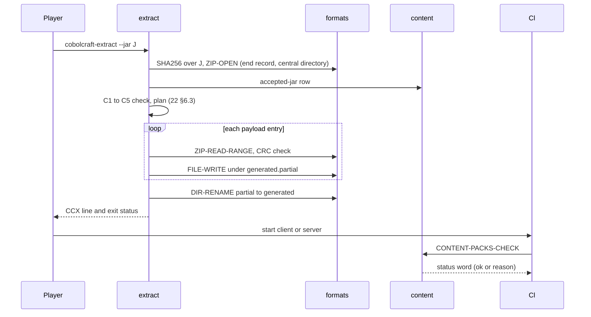
```mermaid
sequenceDiagram
  participant Pl as Player
  participant Ex as extract
  participant Fm as formats
  participant Ct as content
  Pl->>Ex: cobolcraft-extract --jar J
  Ex->>Fm: SHA256 over J, ZIP-OPEN (end record, central directory)
  Ex->>Ct: accepted-jar row
  Ex->>Ex: C1 to C5 check, plan (22 §6.3)
  loop each payload entry
    Ex->>Fm: ZIP-READ-RANGE, CRC check
    Ex->>Fm: FILE-WRITE under generated.partial
  end
  Ex->>Fm: DIR-RENAME partial to generated
  Ex-->>Pl: CCX line and exit status
  Pl->>Cl: start client or server
  Cl->>Ct: CONTENT-PACKS-CHECK
  Ct-->>Cl: status word (ok or reason)
```

**US2 Choose a world type**

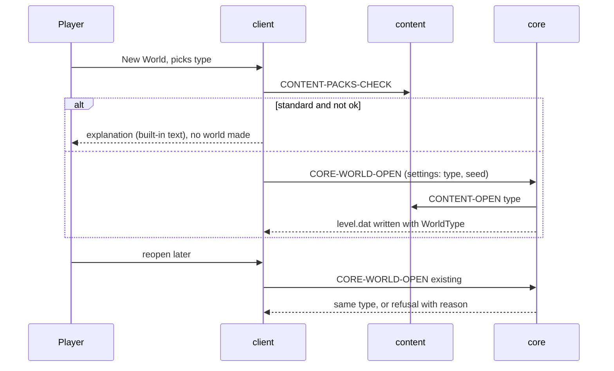
```mermaid
sequenceDiagram
  participant Pl as Player
  participant Cl as client
  participant Ct as content
  participant Co as core
  Pl->>Cl: New World, picks type
  Cl->>Ct: CONTENT-PACKS-CHECK
  alt standard and not ok
    Cl-->>Pl: explanation (built-in text), no world made
  else
    Cl->>Co: CORE-WORLD-OPEN (settings: type, seed)
    Co->>Ct: CONTENT-OPEN type
    Co-->>Cl: level.dat written with WorldType
  end
  Pl->>Cl: reopen later
  Cl->>Co: CORE-WORLD-OPEN existing
  Co-->>Cl: same type, or refusal with reason
```

**US3 Load and use the Faithful pack**

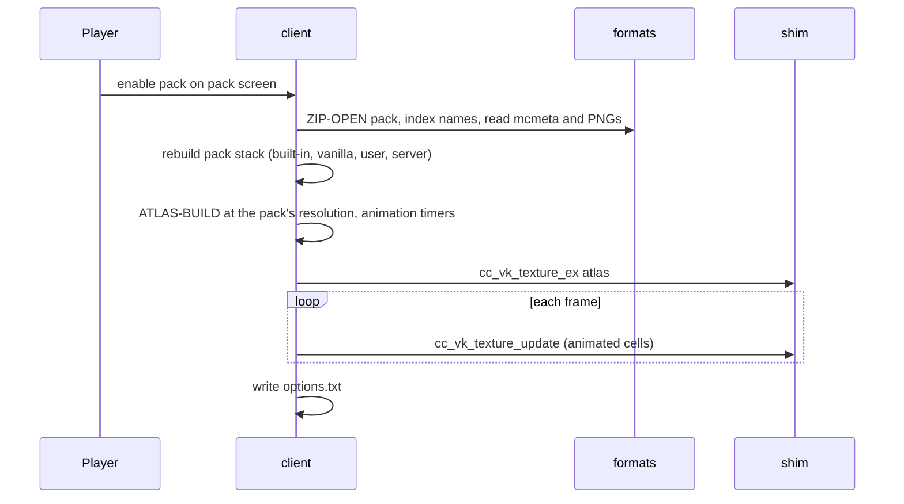
```mermaid
sequenceDiagram
  participant Pl as Player
  participant Cl as client
  participant Fm as formats
  participant Sh as shim
  Pl->>Cl: enable pack on pack screen
  Cl->>Fm: ZIP-OPEN pack, index names, read mcmeta and PNGs
  Cl->>Cl: rebuild pack stack (built-in, vanilla, user, server)
  Cl->>Cl: ATLAS-BUILD at the pack's resolution, animation timers
  Cl->>Sh: cc_vk_texture_ex atlas
  loop each frame
    Cl->>Sh: cc_vk_texture_update (animated cells)
  end
  Cl->>Cl: write options.txt
```

**US4 Open Pack Folder**

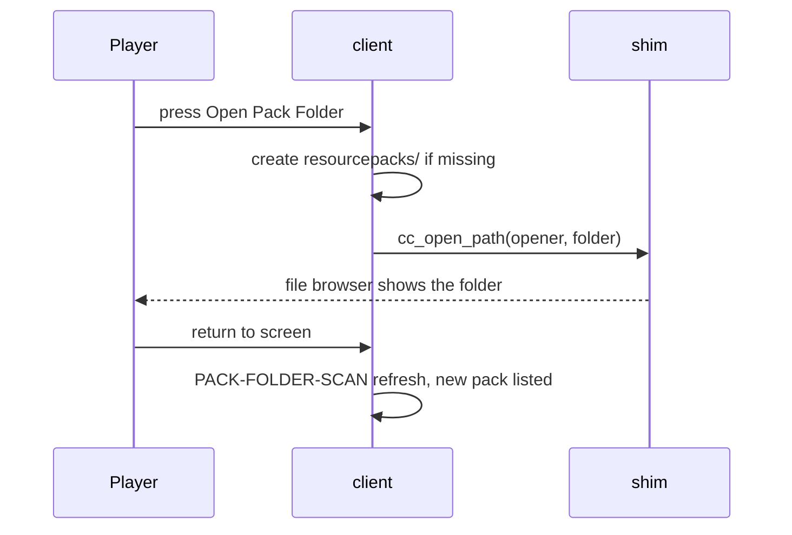
```mermaid
sequenceDiagram
  participant Pl as Player
  participant Cl as client
  participant Sh as shim
  Pl->>Cl: press Open Pack Folder
  Cl->>Cl: create resourcepacks/ if missing
  Cl->>Sh: cc_open_path(opener, folder)
  Sh-->>Pl: file browser shows the folder
  Pl->>Cl: return to screen
  Cl->>Cl: PACK-FOLDER-SCAN refresh, new pack listed
```

**US5 Seamless textures**

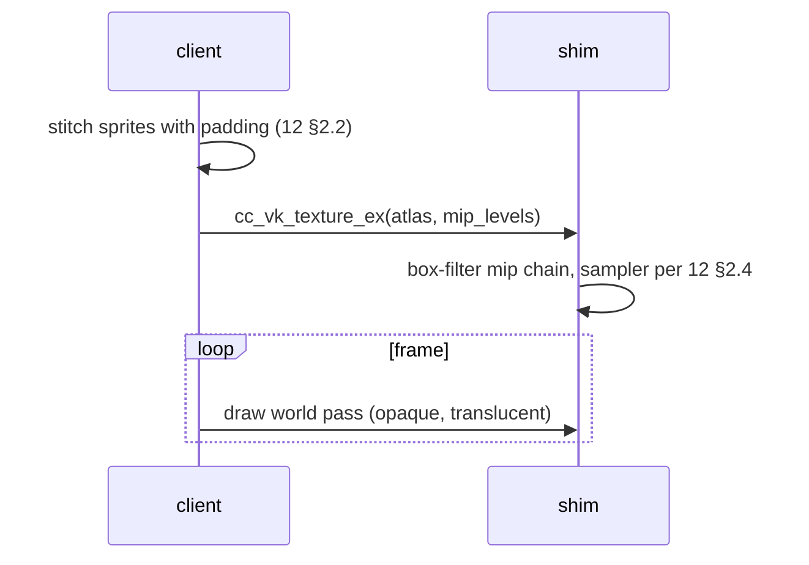
```mermaid
sequenceDiagram
  participant Cl as client
  participant Sh as shim
  Cl->>Cl: stitch sprites with padding (12 §2.2)
  Cl->>Sh: cc_vk_texture_ex(atlas, mip_levels)
  Sh->>Sh: box-filter mip chain, sampler per 12 §2.4
  loop frame
    Cl->>Sh: draw world pass (opaque, translucent)
  end
```

**US6 HUD and screens**

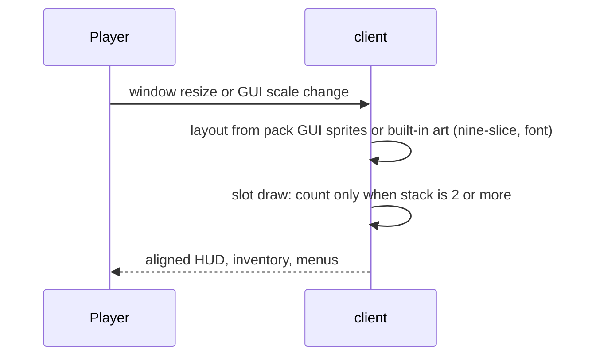
```mermaid
sequenceDiagram
  participant Pl as Player
  participant Cl as client
  Pl->>Cl: window resize or GUI scale change
  Cl->>Cl: layout from pack GUI sprites or built-in art (nine-slice, font)
  Cl->>Cl: slot draw: count only when stack is 2 or more
  Cl-->>Pl: aligned HUD, inventory, menus
```

**US7 Flight only in creative**

```mermaid
sequenceDiagram
  participant Pl as Player
  participant Cl as client
  participant Co as core
  Co-->>Cl: Player Abilities (flags by game mode)
  Pl->>Cl: Space twice quickly
  alt ability allows flight
    Cl->>Co: Player Abilities (flying toggled)
  else survival
    Cl->>Cl: no toggle; jump only while on ground
  end
```

**US8 Break overlay**

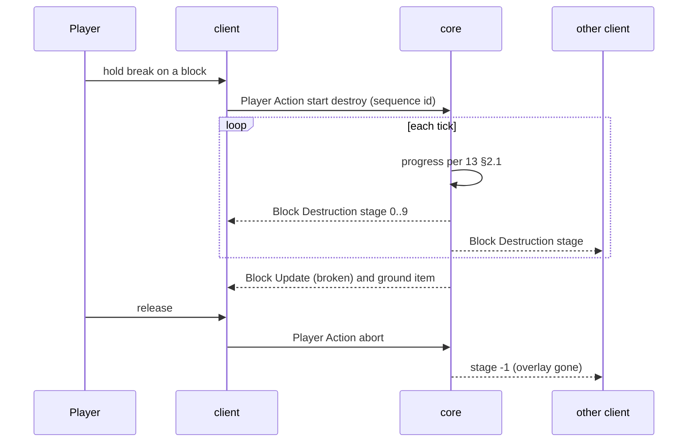
```mermaid
sequenceDiagram
  participant Pl as Player
  participant Cl as client
  participant Co as core
  participant O as other client
  Pl->>Cl: hold break on a block
  Cl->>Co: Player Action start destroy (sequence id)
  loop each tick
    Co->>Co: progress per 13 §2.1
    Co-->>Cl: Block Destruction stage 0..9
    Co-->>O: Block Destruction stage
  end
  Co-->>Cl: Block Update (broken) and ground item
  Pl->>Cl: release
  Cl->>Co: Player Action abort
  Co-->>O: stage -1 (overlay gone)
```

**US9 Inventory crafting and recipe book**

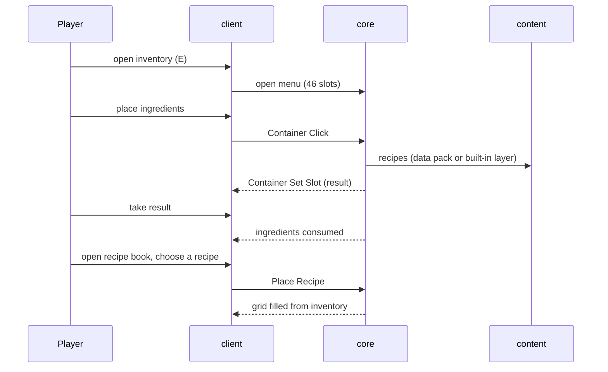
```mermaid
sequenceDiagram
  participant Pl as Player
  participant Cl as client
  participant Co as core
  participant Ct as content
  Pl->>Cl: open inventory (E)
  Cl->>Co: open menu (46 slots)
  Pl->>Cl: place ingredients
  Cl->>Co: Container Click
  Co->>Ct: recipes (data pack or built-in layer)
  Co-->>Cl: Container Set Slot (result)
  Pl->>Cl: take result
  Co-->>Cl: ingredients consumed
  Pl->>Cl: open recipe book, choose a recipe
  Cl->>Co: Place Recipe
  Co-->>Cl: grid filled from inventory
```

**US10 Crafting bench**

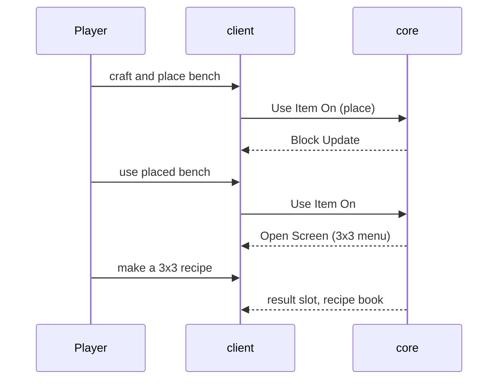
```mermaid
sequenceDiagram
  participant Pl as Player
  participant Cl as client
  participant Co as core
  Pl->>Cl: craft and place bench
  Cl->>Co: Use Item On (place)
  Co-->>Cl: Block Update
  Pl->>Cl: use placed bench
  Cl->>Co: Use Item On
  Co-->>Cl: Open Screen (3x3 menu)
  Pl->>Cl: make a 3x3 recipe
  Co-->>Cl: result slot, recipe book
```

**US11 Standard terrain, caves and ores**

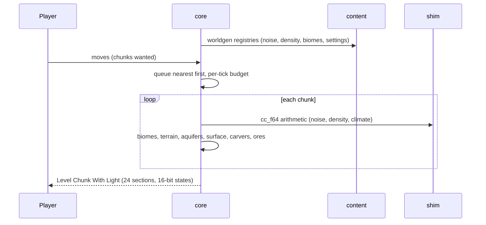
```mermaid
sequenceDiagram
  participant Pl as Player
  participant Co as core
  participant Ct as content
  participant Sh as shim
  Co->>Ct: worldgen registries (noise, density, biomes, settings)
  Pl->>Co: moves (chunks wanted)
  Co->>Co: queue nearest first, per-tick budget
  loop each chunk
    Co->>Sh: cc_f64 arithmetic (noise, density, climate)
    Co->>Co: biomes, terrain, aquifers, surface, carvers, ores
  end
  Co-->>Pl: Level Chunk With Light (24 sections, 16-bit states)
```

**US12 Features, structures, dimensions, redstone**

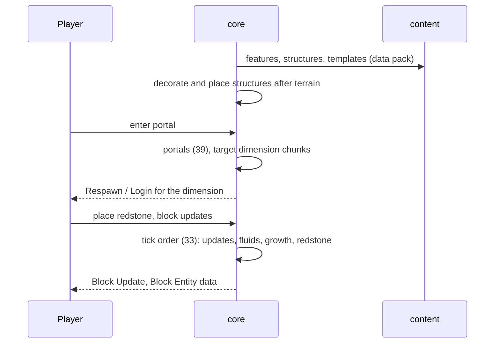
```mermaid
sequenceDiagram
  participant Pl as Player
  participant Co as core
  participant Ct as content
  Co->>Ct: features, structures, templates (data pack)
  Co->>Co: decorate and place structures after terrain
  Pl->>Co: enter portal
  Co->>Co: portals (39), target dimension chunks
  Co-->>Pl: Respawn / Login for the dimension
  Pl->>Co: place redstone, block updates
  Co->>Co: tick order (33): updates, fluids, growth, redstone
  Co-->>Pl: Block Update, Block Entity data
```

**US13 Standard commands**

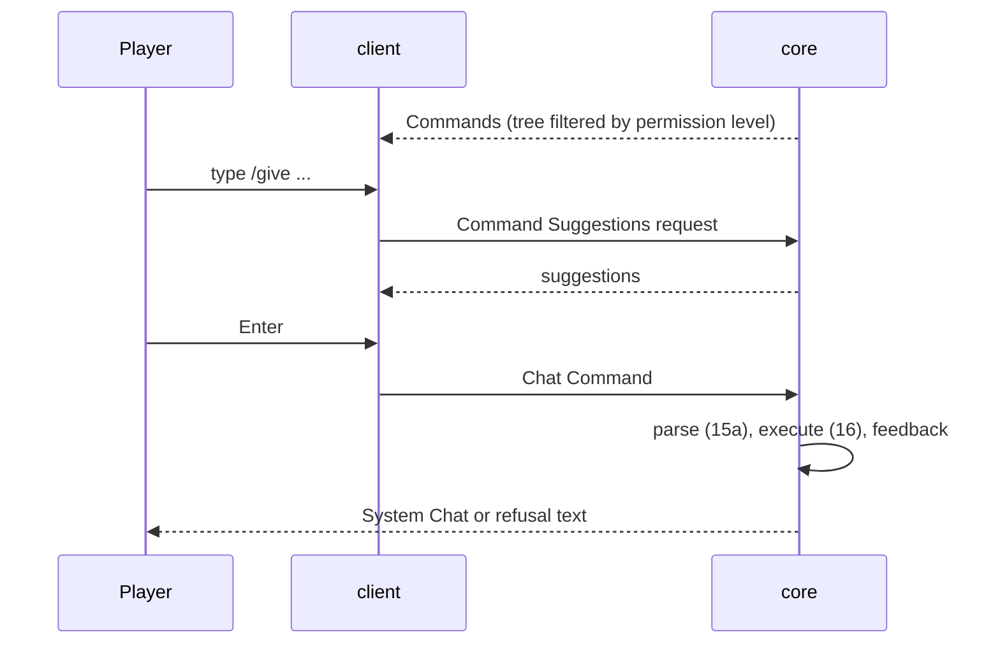
```mermaid
sequenceDiagram
  participant Pl as Player
  participant Cl as client
  participant Co as core
  Co-->>Cl: Commands (tree filtered by permission level)
  Pl->>Cl: type /give ...
  Cl->>Co: Command Suggestions request
  Co-->>Cl: suggestions
  Pl->>Cl: Enter
  Cl->>Co: Chat Command
  Co->>Co: parse (15a), execute (16), feedback
  Co-->>Pl: System Chat or refusal text
```

**US14 Tools, weapons, combat**

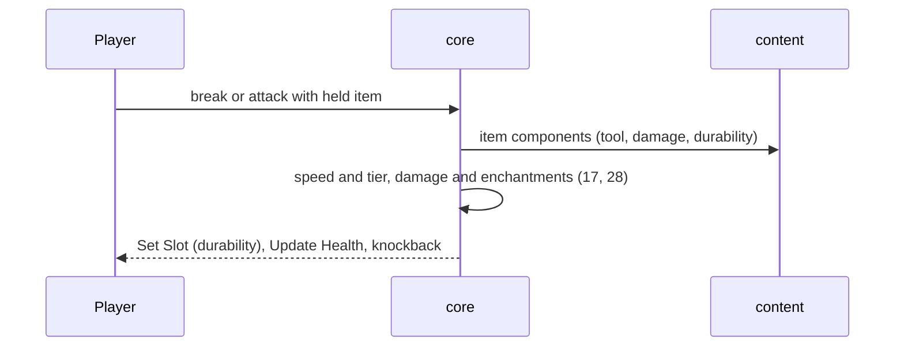
```mermaid
sequenceDiagram
  participant Pl as Player
  participant Co as core
  participant Ct as content
  Pl->>Co: break or attack with held item
  Co->>Ct: item components (tool, damage, durability)
  Co->>Co: speed and tier, damage and enchantments (17, 28)
  Co-->>Pl: Set Slot (durability), Update Health, knockback
```

**US15 Mobs**

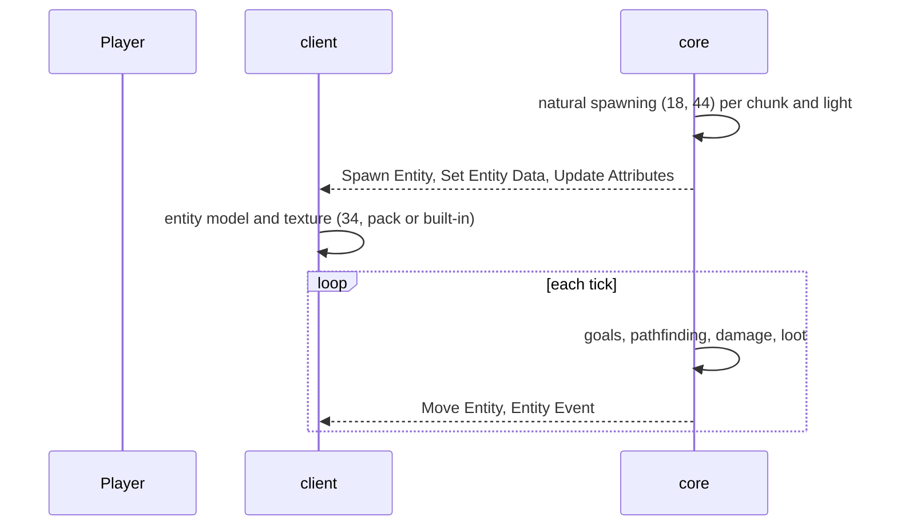
```mermaid
sequenceDiagram
  participant Pl as Player
  participant Cl as client
  participant Co as core
  Co->>Co: natural spawning (18, 44) per chunk and light
  Co-->>Cl: Spawn Entity, Set Entity Data, Update Attributes
  Cl->>Cl: entity model and texture (34, pack or built-in)
  loop each tick
    Co->>Co: goals, pathfinding, damage, loot
    Co-->>Cl: Move Entity, Entity Event
  end
```

**US16 Options**

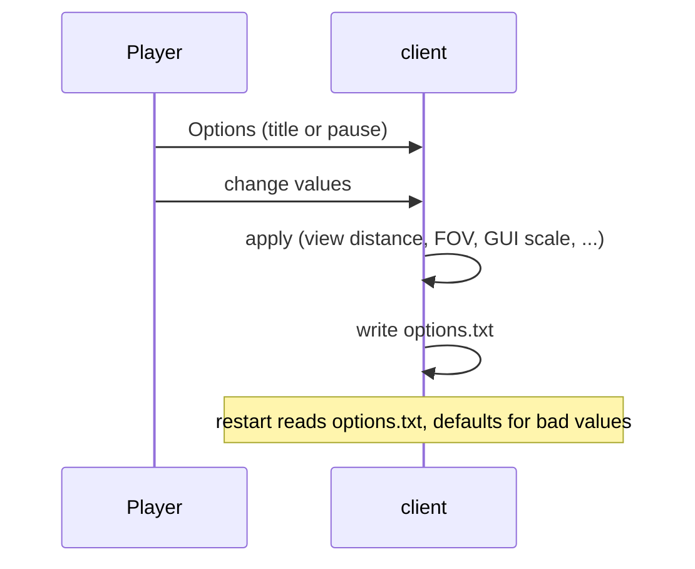
```mermaid
sequenceDiagram
  participant Pl as Player
  participant Cl as client
  Pl->>Cl: Options (title or pause)
  Pl->>Cl: change values
  Cl->>Cl: apply (view distance, FOV, GUI scale, ...)
  Cl->>Cl: write options.txt
  Note over Cl: restart reads options.txt, defaults for bad values
```

**US17 F3 overlay**

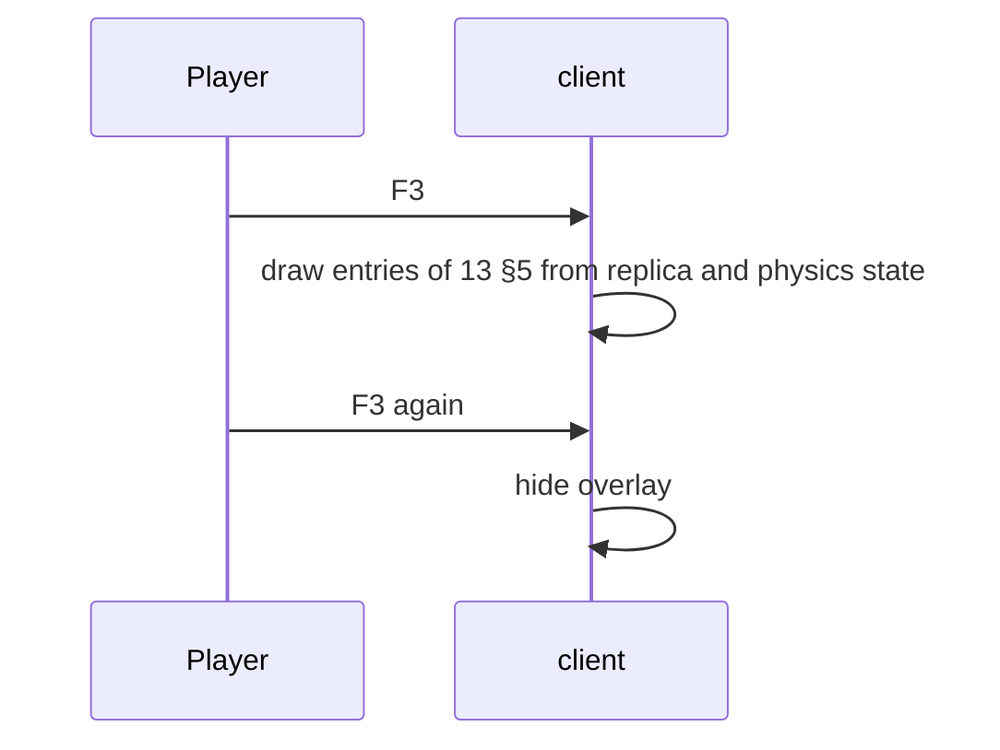
```mermaid
sequenceDiagram
  participant Pl as Player
  participant Cl as client
  Pl->>Cl: F3
  Cl->>Cl: draw entries of 13 §5 from replica and physics state
  Pl->>Cl: F3 again
  Cl->>Cl: hide overlay
```

**US18 F5 camera**

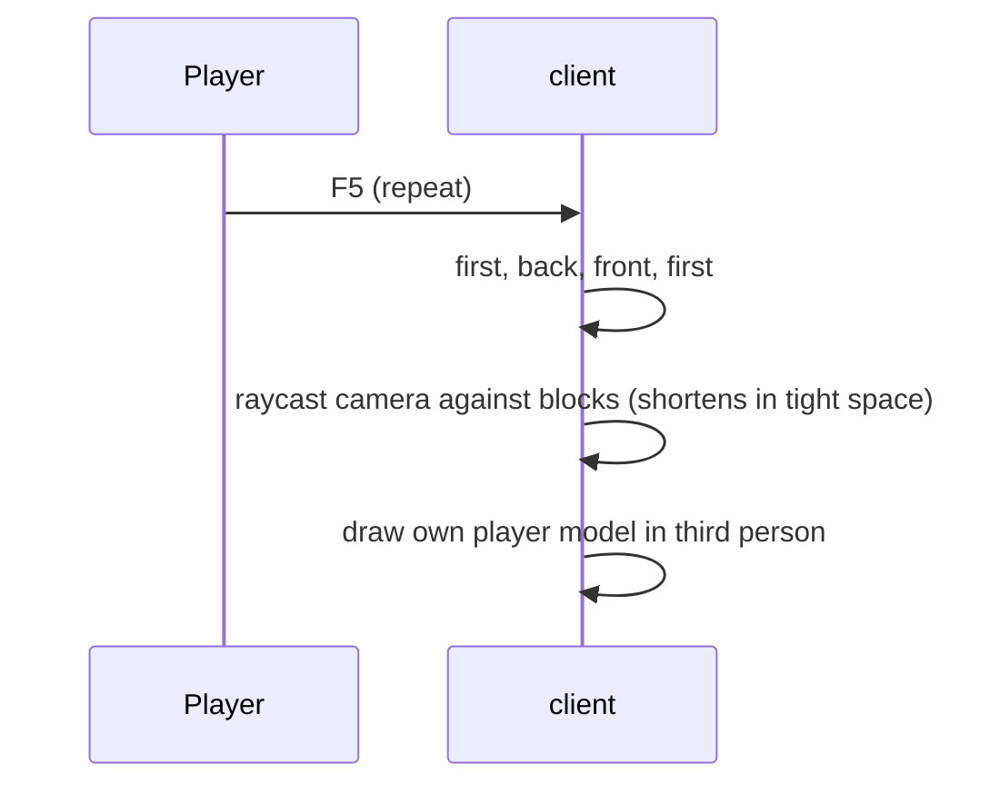
```mermaid
sequenceDiagram
  participant Pl as Player
  participant Cl as client
  Pl->>Cl: F5 (repeat)
  Cl->>Cl: first, back, front, first
  Cl->>Cl: raycast camera against blocks (shortens in tight space)
  Cl->>Cl: draw own player model in third person
```

**US19 Off-hand swap**

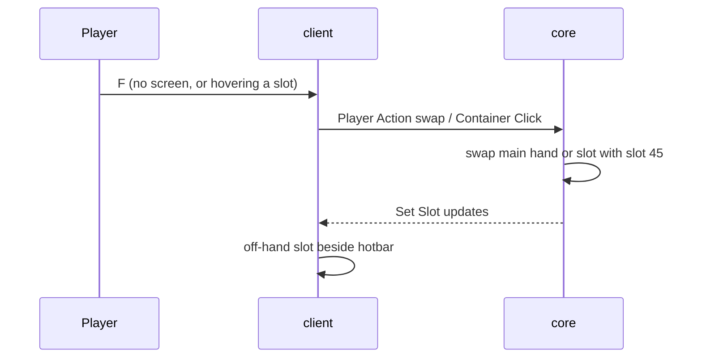
```mermaid
sequenceDiagram
  participant Pl as Player
  participant Cl as client
  participant Co as core
  Pl->>Cl: F (no screen, or hovering a slot)
  Cl->>Co: Player Action swap / Container Click
  Co->>Co: swap main hand or slot with slot 45
  Co-->>Cl: Set Slot updates
  Cl->>Cl: off-hand slot beside hotbar
```

**US20 Hand and held item**

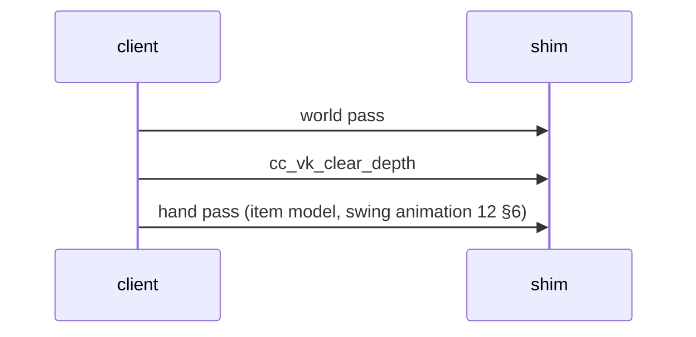
```mermaid
sequenceDiagram
  participant Cl as client
  participant Sh as shim
  Cl->>Sh: world pass
  Cl->>Sh: cc_vk_clear_depth
  Cl->>Sh: hand pass (item model, swing animation 12 §6)
```

**US21 Vanilla-client validation**

```mermaid
sequenceDiagram
  participant V as vanilla client
  participant Co as core
  participant Ct as content
  V->>Co: Handshake, Login (offline)
  Co->>Ct: registries and tags (standard set)
  Co-->>V: Registry Data (51), Update Tags, Finish Configuration
  Co-->>V: Login, spawn chunks (06 encodings)
  Note over V,Co: automated: contract_vanilla_* bytes against documents; manual: real client run recorded (Q-1)
```

## Per-phase gates (constitution 5.4, mode-consistent)

| Phase | Gate task command | Also required |
|---|---|---|
| Setup | `make gate-tools` | |
| Foundational | `make gate-contract && make gate-tools && make gate-formats && make gate-client` | review tasks for each document deliverable (docs rounds, design records) |
| Lane phase `US<n>-<pkg>` | `make gate-<pkg>` (lint, build, instrumented tests including the lane's contract tests, coverage of the package) | |
| Convergence | `make gate` | seam obligation: every package's contract tests ran in their lane gates; no E2E; manual vanilla run recorded (Q-1) |
| Polish | `make gate` | ticket closures; quickstart walk-through |

Each phase's task list carries one explicit `Gate:` task with the phase's command and evidence captured from the
real run (5.4). A lane phase never runs the aggregate `make gate`.
